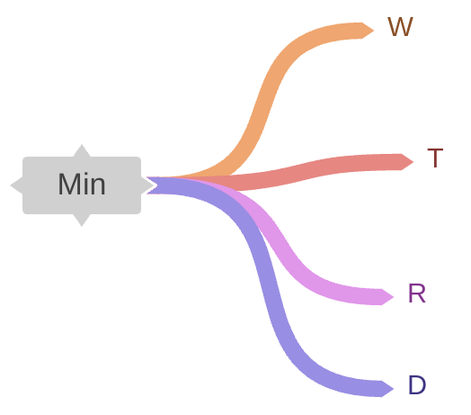

# Noções básicas de inteligência artificial

## Módulo [trailhead](https://trailhead.salesforce.com/pt-BR/content/learn/modules/artificial-intelligence-fundamentals)

### Cáp.01: Introdução à inteligência artificial
#### O que é IA e o que não é IA
Trecho retirado do resumo no final desse capítulo:
> A inteligência artificial pode ser vista como a **capacidade de um computador de realizar tarefas tipicamente associadas à intuição, à inferência e ao raciocínio humanos**. No momento, as habilidades de IA são muito especializadas e entram em categorias mais amplas, como previsões numéricas e processamento de linguagem.

Implicitamente, quando futuramente pensarmos em automações relacionadas à IA, é muito importante ter esse trecho em mente, porque dele, é necessário mapear sub-tarefas, passos, dados e outros envolvidos nas tarefas que idealizamos para um caso de uso relacionado à IA.

Típicas tarefas:
- Tomar decisões
- Reconhecer padrões
- Aprender com dados
- Entender linguagem natural

#### A dificuldade de definir a IA
- Expectativa criada por filmes e especulações baseadas nisso
    - IA não toma decisão se você não programá-la para isso
- Comparação com a inteligência humana
    - Não existe somente inteligência lógico-matemática

> A IA deve ser entendida como algo voltado para tarefas específicas.

#### Vários tipos de capacidade de IA
**Não existe uma IA boa em tudo.**
Mas existem IAs projetadas para realizar tarefas específicas.
##### 1. Previsões Numéricas
* Ex: Prever se um cliente vai cancelar um serviço.
* Ex: Estimar o número de vendas no próximo mês.
* Ex: Calcular o melhor preço para um produto.
* Resultado: um número, uma porcentagem, uma tendência.

##### 2. Classificações
* Ex: Esse email é spam ou não?
* Ex: Essa transação é fraudulenta?
* Ex: Essa imagem é de um cachorro ou gato?
* A IA classifica algo em categorias definidas.

##### 3. Navegação e Adaptação
* Ex: Carros autônomos que seguem rotas e desviam de obstáculos.
* Ex: Robôs que se movem em ambientes incertos.
* Ex: Otimização de entregas e logística considerando trânsito, estoque e demanda.

##### 4. Processamento de Linguagem Natural (PLN)
* Ex: Traduzir textos automaticamente.
* Ex: Resumir textos longos.
* Ex: Gerar respostas em linguagem humana (como faz o ChatGPT).
* Essa é a base das **IAs generativas**, que criam textos, imagens, sons, etc.

#### Resumo e relação com o Agentforce
No contexto atual, a IA:
* **Não pensa** como um ser humano;
* É **especializada em uma tarefa** (ex: classificar emails, prever notas de crédito);
* Precisa de **dados e contexto** para funcionar bem.

##### Conexão com o Agentforce

Para trabalhar com **Agentforce** (Salesforce), entender essa base é essencial, porque:

| Conceito de IA          | Aplicação no Agentforce                              |
| ----------------------- | ---------------------------------------------------- |
| IA especializada        | Cada agente resolve um problema específico           |
| PLN                     | Agentes entendem perguntas e geram respostas         |
| Classificação e decisão | Agentes analisam intenções, contexto e sugerem ações |
| Personalização          | Usa dados do Data Cloud para respostas melhores      |

---

### Cáp.02: Transformar dados em modelos
#### O truque por trás da mágica
- Dados
- Modelos matemáticos (LLM)
- Poder computacional

**Entender isso ajuda a:**
- Saber o que a IA pode (e não pode) fazer;
- Evitar armadilhas e uso errado da IA;
- Aproveitar melhor as funcionalidades da IA no Agentforce.

#### A mudança da criação para o treinamento
O modelo tradicional de programação ealgoritmos usa:
`Entrada >> Processamento (de dados ou conjuntos de dados) >> Saída`
- Entrada: 5, 8, 2, 9 
- Processo: adicionar os valores [5+8+2+9] e dividir pelo número de entradas [4]
- Saída: 6 

Porém algumas tarefas tem tantas regras e exceções que é quase impossível capturá-las todas em um algoritmo manual. Para essas, existe o treinamento. Mas o treinamento exige experiência.

#### Experiência necessária
Aqui nasce o modelo treinado. Nele
- Você não programa todas as regras.
- Você ensina por meio de exemplos.

##### Exemplo do módulo: ida ao mercado
O módulo faz uma simulação de como prever quanto tempo se gasta para ir ao supermercado considerando uma série de **dados**.

- Se é fim de semana (W)
- Hora do dia (T)
- Se está chovendo (R)
- Distância (D)
- Tempo total da tarefa
<!--  -->


Depois de algumas idas é possível entender como os **valores** de cada um dos **dados** afeta o tempo gasto em Minutos. Dessa forma, é possível atribuir **pesos** maiores a valores dos dados que afetam mais o tempo gasto em minutos.

> É dessa forma que acontece o aprendizado de máquina (Machine Learning)

1. Atribua um "peso" a todas as suas entradas. É um número que representa o grau de impacto da entrada na saída. É OK começar com o mesmo peso para tudo.
2. Use os pesos nos dados existentes (e alguma matemática inteligente que não vamos discutir aqui) para estimar os minutos em uma ida ao supermercado para comprar leite. Podemos comparar a estimativa com os dados históricos. Não vai estar correto, mas tudo bem.
3. Deixe o computador adivinhar um novo peso para cada entrada, tornando algumas mais importantes que outras. Por exemplo, a hora do dia pode ser mais importante do que se está chovendo ou não.
4. Refaça os cálculos para verificar se os novos pesos resultarão em uma estimativa melhor. Se sim, isso significa que os pesos estão melhores e estão mudando na direção certa.
5. Repita as etapas 3 e 4 deixando o computador ajustar os pesos até que as estimativas não melhorem mais.


Após essas análises, entenda que cada cor/espessura de linha da imagem acima nos sinalizaria um peso diferente. Nesse processo de tentar adivinhar o tempo gasto para ir ao mercado, com base nos dados, valores e pesos, foi criado um **modelo**

Recapitulando:
- dados
- valores
- pesos
- repetição ajustando pesos e corrigindo erros visando melhoria das previsões
até chegar a um modelo confiável

#### Usar os dados certos para o trabalho certo

| Tipo de Aprendizado    | Tipo de Dado        | Característica Principal  | Fonte  | Exemplo Agf | Entrada (Prompt) | Uso |
| ---------------------- | ------------------- | ------------------- | ------------------| --------- | ----- | ---- | 
| **Supervisionado**     | **Estruturado**     | Cada entrada tem uma saída conhecida. O modelo aprende com base nisso. | 	Data Cloud tabelado / Salesforce Platform | Classificar intenção do cliente	 | Entrada JSON + intenção esperada | Classificação, previsão, decisão
| **Não supervisionado** | **Não estruturado** | Não há saída esperada. O modelo tenta encontrar padrões sozinho.       | Logs de atendimento, feedbacks abertos, e-mails | Descobrir padrões de reclamações | Texto solto + instrução para agrupar, resumir etc. | Resumo, agrupamento, clusterização, insights novos


##### Exemplos (GPT):

###### ✅ 1. **Aprendizado supervisionado com dados estruturados no Agentforce**
**🌐 Exemplo prático:**

>**Caso de uso: Identificar a intenção de um cliente com base em atributos de perfil e comportamento.**

**Fonte dos dados:** Data Cloud + Sales Cloud + logs de interações (estruturados: colunas bem definidas, como idade, segmento, saldo, canal, horário da última interação etc.)

**🧠 Como funciona:**
* Esses dados são usados para **treinar um modelo** que identifica **qual intenção (saída) um cliente provavelmente tem**, por exemplo:
  * Solicitar aumento de limite
  * Renegociar dívida
  * Consultar extrato

**🎯 Aplicação no Agentforce:**
* Você cria um **Prompt Template** no **Prompt Builder** usando uma **estrutura supervisionada**:
  * **Entrada:** JSON com os dados estruturados do cliente
  * **Saída esperada:** intenção classificada
* O Prompt pode se basear em padrões conhecidos (base histórica de dados) e testar a **consistência da saída**.
* Você pode até alimentar esse prompt com exemplos usando o Prompt Grounding (tipo few-shot learning supervisionado).

**💬 Exemplo de Prompt:**
```json
{
  "idade": 37,
  "segmento": "alta renda",
  "última interação": "APP",
  "última ação": "consulta saldo",
  "saldo": 15423.78,
  "produto principal": "Cartão Platinum"
}
```

**Resultado esperado (label supervisionado):**

```json
"intenção": "Solicitar aumento de limite"
```

> Isso é um aprendizado supervisionado: o modelo “aprende” com pares Entrada → Saída conhecidos.

<br>

###### ✅ 2. **Aprendizado não supervisionado com dados não estruturados no Agentforce**
**🌐 Exemplo prático:**

**Caso de uso: Analisar conversas abertas para descobrir novos padrões de atendimento ou assuntos emergentes.**

**Fonte dos dados:** Chat logs, feedbacks de clientes, histórico de chamadas, emails (texto livre, sem estrutura)

**🧠 Como funciona:**
* Você não tem uma saída "correta", apenas grandes volumes de **texto livre**.
* O sistema de IA analisa **padrões recorrentes** nesses textos para agrupar, extrair temas, intenções novas, sentimentos, etc.

**🎯 Aplicação no Agentforce:**
* Usando o **Data Library**, você pode incluir grandes volumes de texto como “contexto” para o Prompt Builder.
* O prompt pode ser instruído a:
  * Extrair **temas comuns**
  * Gerar **resumos semânticos**
  * Detectar **tópicos emergentes**

**💬 Exemplo de Prompt:**

> “Com base nas transcrições de atendimento abaixo, resuma os principais motivos de insatisfação dos clientes.”

```text
Cliente 1: “O app não mostra a fatura do cartão desde semana passada…”
Cliente 2: “Tentei ligar, mas fiquei esperando 20 minutos e desisti…”
Cliente 3: “Tem cobrança indevida na minha conta!”
```

**Saída do Agentforce:**

```json
[
  "Instabilidade no app para consulta de fatura",
  "Tempo de espera elevado no call center",
  "Cobranças indevidas recorrentes"
]
```

> Aqui, **não há rótulo certo**: a IA “descobre” os padrões. Isso é **aprendizado não supervisionado**.

---

### Cáp.03: Entender a necessidade das redes neurais
#### A necessidade das redes neurais
- São ferramentas para treinar modelos de IA.
- Emulam a resolução de problemas como os humanos

Redes neurais permitem que:
- IA identifique relações complexas entre dados de entrada e classificações de saída
- Computadores aprendem quais variáveis e valores são importantes e como eles variam
- Viés: se relacionam com os seus nós (cenários combinatórios)
  - Conexões são orientadas por pesos e vieses

| Elemento     | Função                                                              |
| ------------ | ------------------------------------------------------------------- |
| **Entradas** | As variáveis observadas (ex: dia da semana, chuva, hora do dia)     |
| **Nós**      | Cada nó representa um "cenário" ou combinação de fatores            |
| **Pesos**    | Medem a força da influência de uma variável ou nó                   |
| **Vieses**   | Ajustes personalizados para cenários específicos                    |
| **Saída**    | Resultado final (ex: estimativa de tempo no mercado)                |
| **Camadas**  | Conjuntos de nós empilhados, formando caminhos complexos de decisão |

🔁 De modelo simples a rede neural
1. No modelo simples:
   `Entrada` → `Peso fixo` → `Resultado`
2. Na rede neural:
   `Entrada` → `Nós intermediários com pesos e vieses` → `Combinação` → `Resultado`

> Cada **nó** considera **cenários compostos** e tem **peso + viés**.


#### Como adicionar complexidade às redes neurais
Vamos adicionar complexidade ao modelo de ida ao supermercado mencionado acima.
  

#### Mais do que matemática mental, é matemática de rede neural
##### 🔍 Camadas ocultas e aprendizado profundo

Quando você adiciona **múltiplas camadas de nós**, chamamos isso de:

> **Aprendizado profundo (deep learning)**

Essas **camadas ocultas**:

* Capturam padrões complexos,
* Fazem “saltos” lógicos como nosso cérebro,
* São muito eficazes para **interpretação de linguagem natural**, **visão computacional**, etc.

##### ⚠️ Mas tem um porém: a “caixa-preta”

Mesmo que possamos ver os valores dos **pesos** e **vieses**, não conseguimos explicar facilmente **por que** a rede chegou a uma conclusão.

> Assim como um olheiro experiente no futebol diz “eu só *sei* quem é bom”, uma rede neural apenas responde — sem explicação clara.

Essa falta de interpretabilidade é chamada de **“efeito caixa-preta”** das redes neurais.

<br>

##### 🧠 Pra memorizar com exemplos:

| Se você quer que o Agentforce…             | Então ele usa…                        |
| ------------------------------------------ | ------------------------------------- |
| Entenda a intenção mesmo com frase ambígua | Redes neurais profundas               |
| Avalie contexto e histórico do cliente     | Nós intermediários com pesos e vieses |
| Dê respostas melhores com o tempo          | Aprendizado contínuo com muitos dados |

<br>

##### 🤖 Aplicando no Agentforce

| Conceito                      | Aplicação no Agentforce                                          |
| ----------------------------- | ---------------------------------------------------------------- |
| Vários nós e pesos ajustáveis | Permite ao agente entender nuances no pedido de um usuário       |
| Vieses por cenário            | Exemplo: contexto do canal + perfil do usuário altera a resposta |
| Camadas ocultas               | Permitem o agente responder corretamente mesmo com frases vagas  |
| Caixa-preta                   | Você pode avaliar o resultado, mas não o *porquê* da resposta    |
| Deep learning + PLN           | É o que torna o Agentforce capaz de lidar com linguagem humana   |

<br>

#### ✅ Resumo final

| Conceito-Chave       | Explicação Didática                                    |
| -------------------- | ------------------------------------------------------ |
| Modelo simples       | Um peso por variável. Limitado.                        |
| Rede neural          | Vários nós intermediários com pesos e vieses.          |
| Aprendizado profundo | Muitas camadas ocultas. Processamento sofisticado.     |
| Viés                 | Ajuste extra para cada nó (cenário)                    |
| Caixa-preta          | Rede funciona, mas você não sabe dizer exatamente como |

---

### Navegação
Anterior  | Home       | Próximo 
:--------:|:----------:|:--------: 
⬅️[README](../README.md) | 🏠[README](../README.md)  | [Gen AI basics](./mod-genai-basics.md)➡️


